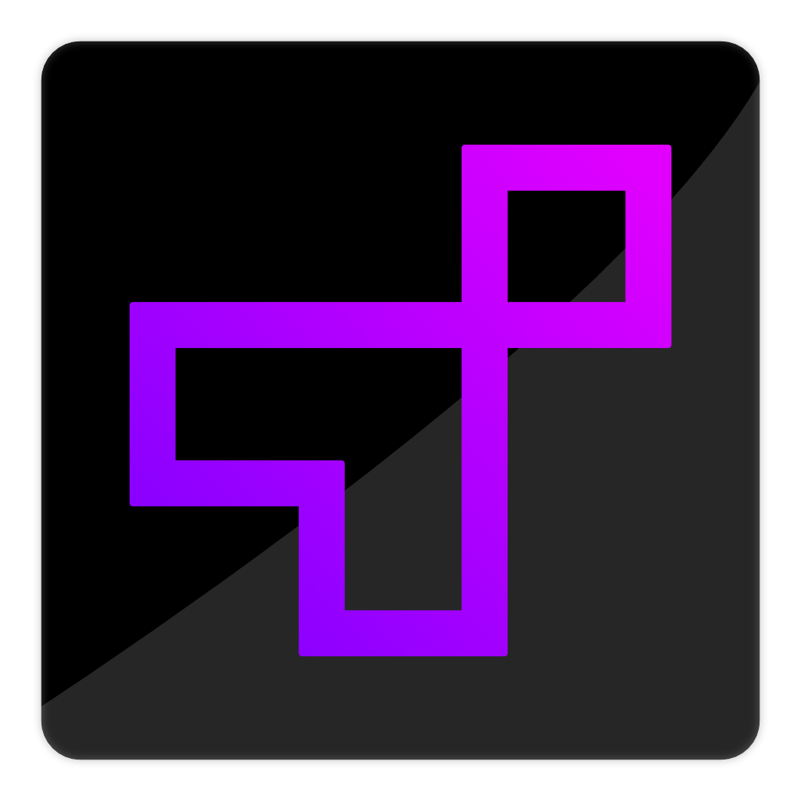

[![Contributors][contributors-shield]][contributors-url]
[![Forks][forks-shield]][forks-url]
[![Stargazers][stars-shield]][stars-url]
[![Issues][issues-shield]][issues-url]
[![MIT License][license-shield]][license-url]

<!-- PROJECT LOGO -->
 

  

  <h3 align="center">Termux</h3>

  

    Java Terminal UX Library
     
    <!-- <a href="https://github.com/github_username/repo_name"><strong>Explore the docs »</strong></a> -->
    <!--   -->
    <!--   -->
    <a href="https://github.com/pomaretta/termux/issues">Report Bug</a>
    ·
    <a href="https://github.com/pomaretta/termux/issues">Request Feature</a>
  

 
 

<!-- ABOUT THE PROJECT -->
## About The Project

To be done...

### Built With

* [Java 1.8]()

<!-- GETTING STARTED -->
## Getting Started

To get a local copy up and running follow these simple steps.

### Prerequisites

Download the build of the current library from releases.

**Or**

Download the source code.

<!-- CONTRIBUTING -->
## Contributing

Contributions are what make the open source community such an amazing place to be learn, inspire, and create. Any contributions you make are **greatly appreciated**.

1. Fork the Project
2. Create your Feature Branch (`git checkout -b feature/AmazingFeature`)
3. Commit your Changes (`git commit -m 'Add some AmazingFeature'`)
4. Push to the Branch (`git push origin feature/AmazingFeature`)
5. Open a Pull Request

<!-- LICENSE -->
## License

Distributed under the MIT License. See `LICENSE` for more information.

<!-- CONTACT -->
## Contact

Carlos Pomares - [@pomaretta](https://twitter.com/pomaretta)

Project Link: [https://github.com/pomaretta/termux](https://github.com/pomaretta/termux)

<!-- MARKDOWN LINKS & IMAGES -->
<!-- https://www.markdownguide.org/basic-syntax/#reference-style-links -->
[contributors-shield]: https://img.shields.io/github/contributors/pomaretta/termux.svg?style=for-the-badge
[contributors-url]: https://github.com/pomaretta/termux/graphs/contributors
[forks-shield]: https://img.shields.io/github/forks/pomaretta/termux.svg?style=for-the-badge
[forks-url]: https://github.com/pomaretta/termux/network/members
[stars-shield]: https://img.shields.io/github/stars/pomaretta/termux.svg?style=for-the-badge
[stars-url]: https://github.com/pomaretta/termux/stargazers
[issues-shield]: https://img.shields.io/github/issues/pomaretta/termux.svg?style=for-the-badge
[issues-url]: https://github.com/pomaretta/termux/issues
[license-shield]: https://img.shields.io/github/license/pomaretta/termux.svg?style=for-the-badge
[license-url]: https://github.com/pomaretta/termux/blob/master/LICENSE.txt